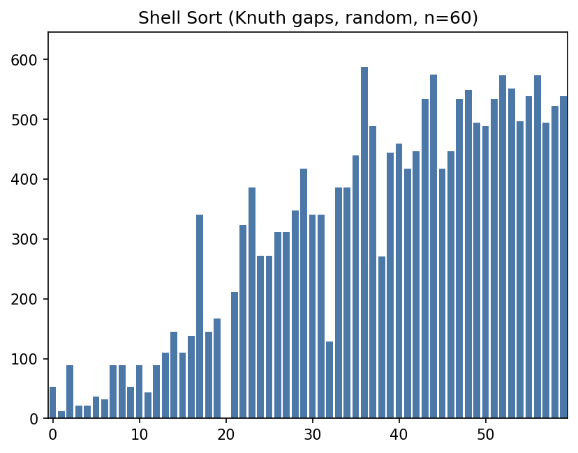
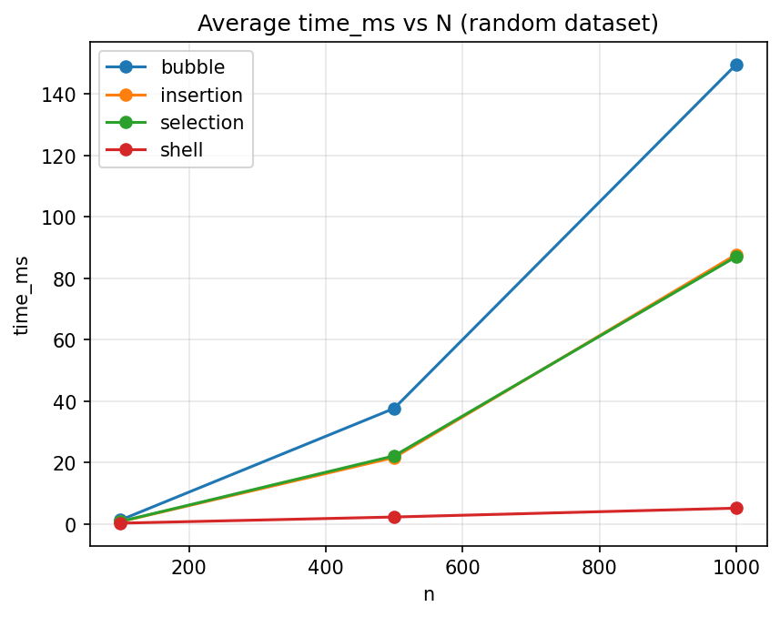
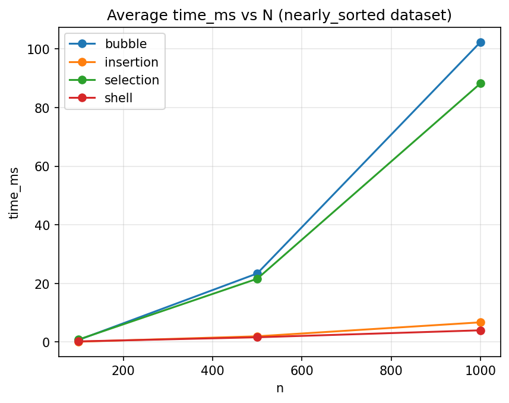

# Project 1 – Sorting Algorithms (Visualization + Benchmarking)

## Overview
This project implements classic sorting algorithms with **instrumentation**, **event-driven visualization**, and **benchmarking**. It supports Bubble, Insertion, Selection, and Shell Sort (with multiple gap sequences), plus deterministic dataset generators and CSV/JSON result export.

## Features
- Sorting algorithms: Bubble, Insertion, Selection, Shell
- Shell gap variants: Shell, Knuth, Hibbard, Tokuda
- Instrumentation: comparisons, swaps, writes, elapsed time (ms)
- Event-driven visualization with live counters
- Deterministic datasets with seed control
- Benchmark runner with CSV/JSON output
- Pytest coverage for correctness and trace/bench consistency

## Project Structure
```
.
├── sorts/
│   ├── bubble.py
│   ├── insertion.py
│   ├── selection.py
│   ├── shell.py
│   └── gaps.py
├── instrumentation.py
├── visualizer.py
├── benchmark.py
├── datasets.py
├── main.py
├── results/
└── tests/
```

## Requirements
- Python 3.10+ recommended
- `matplotlib` for visualization
- `pillow` for GIF export (only needed for `scripts/generate_visuals.py`)

Install dependencies (if needed):
```
python3 -m pip install matplotlib pillow pytest
```

## Docker (Optional)
Build the image:
```
docker build -t sorting-project .
```

Run benchmarks (mount results folder):
```
docker run --rm -v "$(pwd)/results:/app/results" sorting-project \\
  python main.py bench --algo all --sizes 100 500 1000 --trials 10 --out results/benchmarks/results.csv
```

Run tests:
```
docker run --rm sorting-project python -m pytest
```

Generate visuals/plots (headless):
```
docker run --rm -v "$(pwd)/results:/app/results" sorting-project \\
  python scripts/generate_visuals.py
docker run --rm -v "$(pwd)/results:/app/results" sorting-project \\
  python scripts/generate_plots.py
```

## Usage

### Visualization
```
python3 main.py viz --algo bubble --n 50 --seed 123
python3 main.py viz --algo shell --gap knuth --n 60 --speed 2
python3 main.py viz --algo insertion --n 60 --dataset nearly_sorted --seed 42
```

Options:
- `--algo`: bubble | insertion | selection | shell
- `--n`: dataset size
- `--seed`: RNG seed
- `--dataset`: random | sorted | reversed | nearly_sorted | few_unique
- `--gap`: shell | knuth | hibbard | tokuda (shell only)
- `--speed`: animation speed multiplier

### Benchmarking
```
python3 main.py bench --algo all --sizes 100 500 1000 --trials 10 --out results/benchmarks/results.csv
python3 main.py bench --algo shell --gaps shell knuth hibbard --sizes 200 500 --datasets random reversed --trials 5 --out results/benchmarks/shell.json
```

Output fields:
```
algorithm, gap_variant, n, dataset, trial, seed, time_ms, comparisons, swaps, writes
```

### Testing
```
python3 -m pytest
```

## Report (Implementation, Results, Findings)
This section is structured for synthesis into a single document. It summarizes what was built, how results were produced, and the main findings, with references to the included artifacts under `results/`.

### Implementation Summary
- Algorithms: Bubble, Insertion, Selection, Shell (multiple gap sequences).
- Instrumentation: comparisons, swaps, writes, and elapsed time (ms).
- Event-driven visualization: algorithms emit events; the visualizer consumes events and renders live counters.
- Deterministic datasets: reproducible data generation by seed.
- CLI: `viz` for visualization, `bench` for benchmarking, `tests` for correctness.

### Methodology (Benchmark + Visualization)
- **Environment**: record OS, CPU, RAM, Python version, and whether Docker was used.
- **Datasets**: `random`, `sorted`, `reversed`, `nearly_sorted`, `few_unique`.
- **Sizes**: default benchmark sizes are 50, 100, 200, 500, 1000, 2000, 5000 (override with `--sizes`).
- **Trials**: repeated runs per size/dataset (`--trials`), with deterministic seeds.
- **Timing**: `time.perf_counter()` around algorithm execution in benchmark mode.
- **Metrics**: comparisons, swaps, writes, elapsed time (ms).

### Results Summary (Artifacts)
- **Benchmark CSV**: `results/benchmarks/results.csv` (full sweep).
- **Shell gap comparison**: `results/benchmarks/shell.json`.
- **Insertion (nearly_sorted) focus**: `results/benchmarks/insertion.csv`.
- **Plots**: `results/plots/time/`, `results/plots/metrics/`, `results/plots/shell/`.
- **Visuals**: `results/visuals/highlights/` (key GIFs), `results/visuals/all/` (full set).

### Results Summary (Key Tables)
Average `time_ms` at n=1000, dataset = random (10 trials per algorithm; Shell averaged across 4 gaps, 40 trials):

| Algorithm | Avg time_ms |
|---|---|
| shell (avg over gaps) | 5.1695 |
| selection | 87.0224 |
| insertion | 87.7293 |
| bubble | 149.5781 |

Average `time_ms` at n=1000, dataset = nearly_sorted (10 trials per algorithm; Shell averaged across 4 gaps, 40 trials):

| Algorithm | Avg time_ms |
|---|---|
| shell (avg over gaps) | 3.7796 |
| insertion | 6.6988 |
| selection | 88.2358 |
| bubble | 102.3349 |

Shell gap variants at n=1000, dataset = random (10 trials per gap):

| Gap Variant | Avg time_ms |
|---|---|
| tokuda | 5.0927 |
| knuth | 5.0984 |
| shell | 5.1734 |
| hibbard | 5.3135 |

### Selected Visuals and Plots
Key visualization highlights:




Key benchmark plots:




### Findings / Discussion
These findings summarize the observed trends in the current artifacts. See the plots and CSV/JSON outputs for exact values.
- Shell Sort is consistently the fastest on larger random inputs, with gap choice impacting runtime (see `results/benchmarks/shell.json` and `results/plots/shell/`).
- Insertion Sort excels on nearly sorted data, reflecting its near-linear best-case behavior (see `results/benchmarks/insertion.csv` and `results/plots/time/`).
- Selection Sort has stable but high comparison counts across datasets because it always scans the remaining suffix (see `results/plots/metrics/`).
- Bubble Sort is the slowest on random and reversed data due to quadratic swaps and comparisons.
- For already sorted arrays, Bubble and Insertion show near-linear comparisons, while Selection remains quadratic.

### Appendix: Repro Commands
Benchmark sweep:
```
python3 main.py bench --algo all --sizes 50 100 200 500 1000 2000 5000 --trials 10 --out results/benchmarks/results.csv
```
Shell gap comparison:
```
python3 main.py bench --algo shell --gaps shell knuth hibbard tokuda --sizes 100 500 1000 --datasets random reversed --trials 10 --out results/benchmarks/shell.json
```
Insertion on nearly sorted data:
```
python3 main.py bench --algo insertion --sizes 100 500 1000 --datasets nearly_sorted --trials 10 --out results/benchmarks/insertion.csv
```
Visualizations and plots:
```
python3 scripts/generate_visuals.py
python3 scripts/generate_plots.py
```

## Instrumentation & Event Model
Metrics are consistent across algorithms:
- **comparisons**: increments on every key comparison
- **swaps**: increments when two positions are exchanged
- **writes**: increments on every assignment into the array (swaps count as 2 writes)
- **time_ms**: elapsed wall-clock time using `time.perf_counter()`

Event types emitted in trace mode:
- `compare(i, j)`
- `swap(i, j)`
- `write(i, value)`
- `mark(i, label)` (optional)

Each event carries current counters (comparisons, swaps, writes), enabling live visualization.

## Datasets (Deterministic)
- `random`: uniform random values
- `sorted`: ascending
- `reversed`: descending
- `nearly_sorted`: ~3% random swaps
- `few_unique`: many duplicates

## Shell Gap Variants
- `shell`: n/2, n/4, ..., 1
- `knuth`: 1, 4, 13, 40, ... (reverse order during sorting)
- `hibbard`: 1, 3, 7, 15, ...
- `tokuda`: 1, 4, 9, 20, 46, ...

## Notes
- Sorting logic is independent of visualization logic (event-driven).
- Large benchmark outputs should stay in `results/`.
- Benchmark seeds are deterministically derived from the provided base seed (`--seed`).
- Default benchmark sizes: 50, 100, 200, 500, 1000, 2000, 5000 (override with `--sizes`).

## Submission Artifacts
Outputs included for submission (include these even though `results/` is gitignored):
- `results/benchmarks/results.csv` (full benchmark sweep across all algorithms)
- `results/benchmarks/shell.json` (Shell Sort gap comparison)
- `results/benchmarks/insertion.csv` (Insertion Sort on nearly_sorted dataset)
- `results/visuals/highlights/bubble_random_n50.gif` (visualization GIF)
- `results/visuals/highlights/shell_knuth_snapshot.png` (visualization snapshot)
- `results/visuals/all/` (comprehensive GIF set)
  - `results/visuals/all/bubble/`
  - `results/visuals/all/insertion/`
  - `results/visuals/all/selection/`
  - `results/visuals/all/shell/`
- `results/plots/time/` (time vs n plots for each dataset)
- `results/plots/metrics/` (comparisons/swaps/writes vs n plots)
- `results/plots/shell/` (Shell gap comparison plots)

To reproduce visuals and plots:
```
python3 scripts/generate_visuals.py
python3 scripts/generate_plots.py
```

## Observations (From Current Artifacts)
- For the random dataset at n=1000 (averaged across trials), Shell Sort (shell gaps) is fastest (~5.17 ms), while Selection and Insertion are similar (~87 ms) and Bubble is slowest (~150 ms).
- On nearly_sorted data at n=1000, Insertion Sort is dramatically faster (~6.7 ms) than Bubble/Selection and uses far fewer comparisons/writes, matching its best‑case behavior.
- On sorted data at n=1000, Bubble and Insertion are near‑linear (~999 comparisons), while Selection still performs ~499,500 comparisons because it always scans the remaining suffix.
- On reversed data at n=1000, Bubble and Insertion hit worst‑case comparisons (~499,500) and much higher write counts, while Shell remains low (~4.13 ms).
- Across the runs in `results/benchmarks/shell.json`, Knuth gaps show the lowest average time (~1.08 ms), followed by Hibbard (~1.16 ms), then Shell (~1.29 ms).

## CLI Reference
- `viz`: `--algo`, `--n`, `--seed`, `--dataset`, `--gap`, `--speed`
- `bench`: `--algo`, `--sizes`, `--datasets`, `--trials`, `--seed`, `--gaps`, `--out`

## Results Layout
```
results/
  README.md
  benchmarks/
    results.csv
    shell.json
    insertion.csv
  plots/
    time/
    metrics/
    shell/
  visuals/
    highlights/
    all/
```
